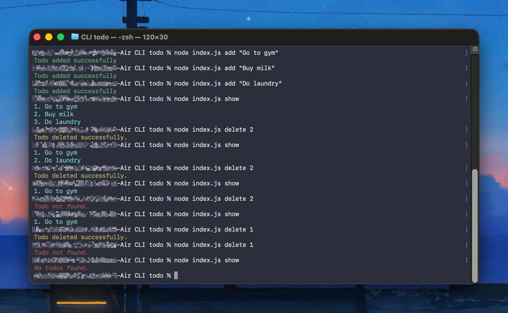

# CLI Todo

A simple Command Line Interface (CLI) Todo application built using **Node.js**, **Commander.js**, **Chalk**, and the **Node.js File System**.

The application allows you to manage your todos directly from the terminal by adding, viewing, and deleting tasks. Todos are stored locally in a JSON file, making the application lightweight and easy to use.

---

## Features

* Add new todos
* View all todos
* Delete existing todos
* Input validation for invalid or empty inputs
* Colored terminal output using Chalk
* Persistent local storage using the Node.js File System
* Built using asynchronous file operations with `fs/promises`

---

## Technologies Used

* Node.js
* Commander.js
* Chalk
* Node.js File System (`fs/promises`)

---

## Installation

### Clone the repository

```bash
git clone https://github.com/dhanik0003/CLI-todo.git
```

### Navigate into the project

```bash
cd CLI-todo
```

### Install dependencies

```bash
npm install
```

---

## Usage

### Add a Todo

```bash
node index.js add "Go to gym"
```

Example Output

```text
Todo added successfully
```

---

### Show All Todos

```bash
node index.js show
```

Example Output

```text
1. Go to gym
2. Do laundry
3. Buy groceries
```

---

### Delete a Todo

```bash
node index.js delete 2
```

Example Output

```text
Todo deleted successfully
```

---

## Project Structure

```
CLI-todo/
│
├── index.js
├── a.txt
├── package.json
├── package-lock.json
├── .gitignore
└── README.md
```

* **index.js** - Main application file containing all CLI commands.
* **a.txt** - Stores the todo list in JSON format.
* **package.json** - Project metadata and dependencies.
* **package-lock.json** - Dependency lock file.
* **.gitignore** - Files ignored by Git.
* **README.md** - Project documentation.

---

## Author

**Dhanik**

GitHub: https://github.com/dhanik0003

---

## Screenshot


